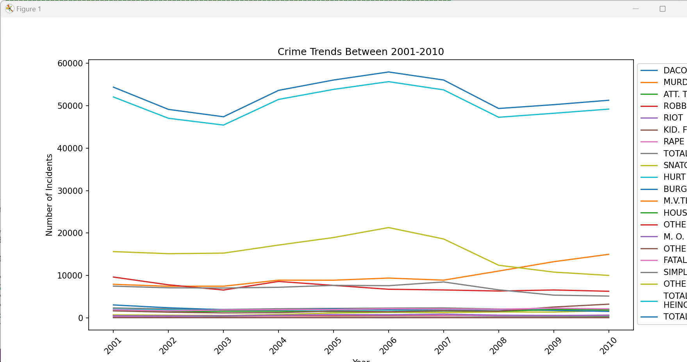

# crime-data-visualization
Visualization of crime data between 2001-2010 (obtained from open data made availavble courtesy of New Delhi Police) using matplotlib and pandas.

We first extract the data from the `crime-data.pdf` file into a CSV using pdfplumber. Then we can read this data with pandas and visualize it into different graphs with pyplot (from matplotlib).

Pie Chart:

Trend Chart:

Bar Graph:

